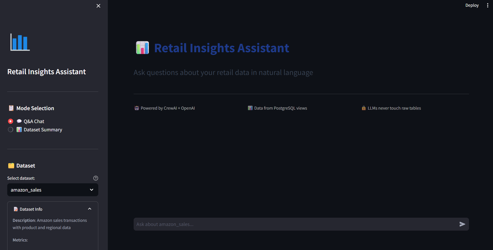
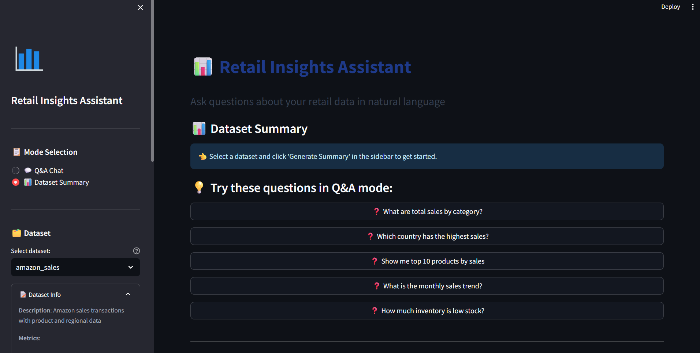
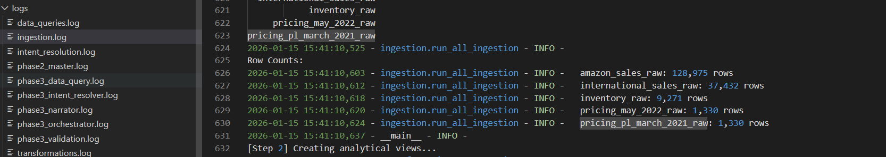

# Retail Insights Assistant - GenAI Assistant

## Overview
A production-ready GenAI assistant for retail analytics that combines data engineering with multi-agent AI to provide natural language insights from sales data. The system features a 4-agent architecture with strict governance and a Streamlit UI.

## 🏗️ Architecture

### 4-Agent System with Anti-Hallucination Guardrails
1. **Intent Resolver Agent** (OpenAI) - Natural language → structured JSON intent
2. **Data Query Agent** (NO LLM) - SQL templates only → PostgreSQL execution
3. **Validation Agent** - Governance firewall (metrics, dimensions, result sanity)
4. **Insight Narrator Agent** (OpenAI) - Numbers → business-friendly text

### Critical Governance Rule
**LLMs never touch raw tables.** All data access is through governed views:
- `sales_fact_view` - Unified sales transactions
- `product_dim_view` - Master product catalog
- `inventory_dim_view` - Current stock status

## 🚀 Quick Start

### 1. Environment Setup
```bash
# Clone repository
git clone <repository-url>
cd retail-insights-assistant

# Create virtual environment
python -m venv .venv
source .venv\Scripts\activate

# Install dependencies
pip install -r requirements.txt
```

### 2. Database Configuration
Update `.env` file:
```env
# Database
DB_HOST=localhost
DB_PORT=5432
DB_NAME=retail_analytics
DB_USER=postgres
DB_PASSWORD=your_password

# OpenAI (required)
OPENAI_API_KEY=your_openai_api_key_here

```

### 3. Data Ingestion 
```bash
# Ensure CSV files are in data/raw/
# Run data pipeline
python run_ingestion.py

```

### 4. Launch GenAI Assistant
```bash
# Option 1: Start Streamlit UI
streamlit run src/ui/streamlit_app.py

# Option 2: Test agents directly
python run_agent.py --test

# Option 3: Test specific query
python run_agent.py --query "What are total sales by category?"
```

## 📸 UI Walkthrough

### Home Screen

- Dataset selection (Amazon Sales, Inventory, Products)
- Mode selection (Q&A Chat or Dataset Summary)

### Summary Mode

- Pre-defined aggregate queries
- Automated business insights

### Generated Summary

- Concise performance summaries
- Key metrics and trends

### Q&A Chat


- Natural language queries
- Real-time agent processing
- Data preview and visualization

### System Monitoring

- Agent decision logs
- SQL query audit trail
- Validation outcomes

## 🔧 System Features

### Core Capabilities
- **Natural Language Queries**: "Which category has highest sales in India?"
- **Multi-Dataset Support**: Amazon sales, inventory, products
- **Governed Data Access**: SQL templates prevent hallucinations
- **Business-Ready Insights**: Narrated results with context

### Technical Highlights
- **FAISS Vector DB**: Semantic search on metadata
- **SQL Templates Only**: No free-form generation
- **Validation Firewall**: Confidence-based decision making
- **Streamlit UI**: Interactive chat interface

## 🗂️ Available Datasets

### 1. Amazon Sales
- **129K+ transactions** across categories and regions
- **Metrics**: Sales amount, units sold, order count, average order value
- **Dimensions**: Category, country, region, month, product, channel

### 2. Inventory
- **1.2K+ SKUs** with stock levels
- **Metrics**: Current stock, low stock count, out-of-stock count
- **Dimensions**: Category, size, stock status

### 3. Products
- **Master catalog** with 3.5K+ SKUs
- **Metrics**: Product count, Amazon availability
- **Dimensions**: Category, size, product type

## 📊 Example Queries

### Sales Analysis
- "What are total sales by category?"
- "Top 10 products by sales in India"
- "Monthly sales trend for Electronics"
- "Compare sales by country"

### Inventory Insights
- "Current stock by category"
- "Low stock items count"
- "Inventory status summary"

## 🛡️ Governance & Safety

### Validation Rules
1. **Metric Validation**: Must exist in dataset catalog
2. **Dimension Validation**: Must be valid for selected dataset
3. **Result Sanity**: Row limits, null value checks
4. **Confidence Threshold**: <0.8 confidence → clarification

### Anti-Hallucination Measures
- SQL templates only (no free-form generation)
- Validation agent as firewall
- Narrator agent cannot invent data
- All data sourced from governed views

## ⚠️ Assumptions & Limitations

### Current Implementation
- **Data Volume**: Optimized for ~130K transaction rows
- **LLM Dependency**: Requires OpenAI API key
- **Data Freshness**: Static snapshot (no real-time updates)
- **Query Complexity**: Handles aggregate, compare, trend, top-N queries

### Known Limitations
- No forecasting or predictive analytics
- No YoY/QoQ calculations (unless trivial)
- Limited to predefined metric dictionary
- English language queries only

## 🔄 Possible Improvements

### Short-term (Phase 3.1)
- Query caching for repeated questions
- Conversation memory (session context)
- Additional visualization types
- Export formats (PDF, Excel)

### Medium-term (Phase 4)
- Real-time data streaming
- Advanced analytics (YoY, forecasting)
- Multi-language support
- Role-based access control

### Long-term (Scale to 100GB+)
- Distributed processing (PySpark/Dask)
- Cloud data warehouse integration
- Vector DB for full-text RAG
- LLM cost optimization


### Logs Location
- `logs/intent_resolution.log` - Intent JSON and user queries
- `logs/data_queries.log` - Generated SQL and row counts
- `logs/phase3_*.log` - Agent-specific decisions

## 📋 Exit Checklist

- [x] Natural language query → valid SQL
- [x] Correct numerical results
- [x] Business-friendly narration
- [x] Anti-hallucination validation
- [x] Streamlit UI with both modes
- [x] FAISS metadata search
- [x] 4-agent architecture
- [x] Complete logging system

## 📞 Support

For issues:
1. Check logs in `logs/` directory
2. Review agent decisions in logs

---

**System Status**: ✅ Production Ready  
**Last Updated**: January 2024  
**Version**: 1.0 (GenAI + Agents + UI)